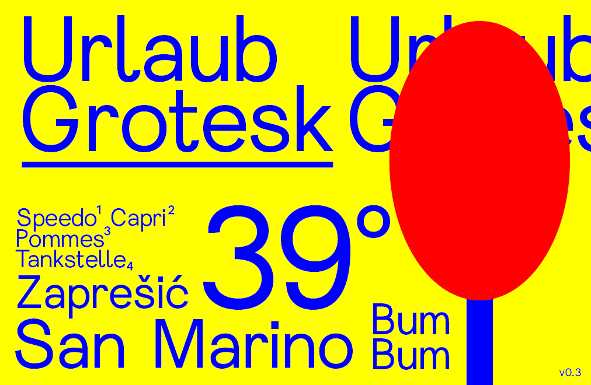
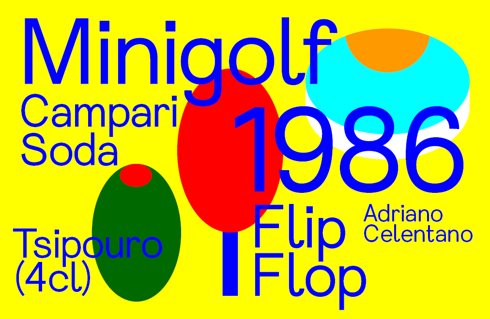
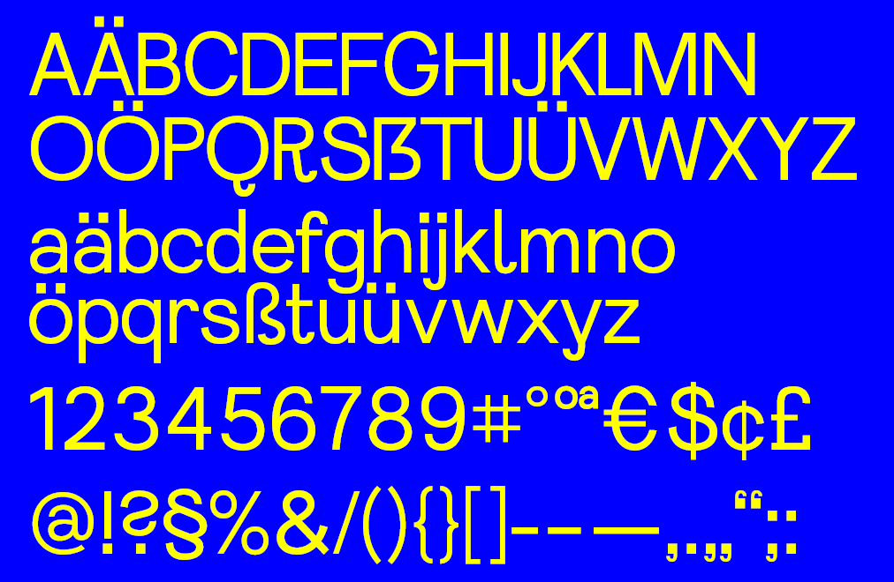

# Urlaub Grotesk (v0.3)

* *Urlaub Grotesk* is a measure to deal with my personal longing for a holiday in the south in the corona-summer of 2020
* it is in a very much *work-in-progress* state
* since there is no kerning implemented you should use *optical kerning* if you’re using the Adobe Suite
* You are *free to use and modify* it in all your (also non-holiday-related) projects now and in the future 

## Specimen

## Version

Current Version is: 0.300

## Planned Future Features

* kerning
* reworked accented characters
* small caps
* arrows
* circled numbers
* more weights

## License

**Urlaub Grotesk** is available under the SIL Open Font License v1.1

See [OFL.txt](OFL.txt) for more details.
